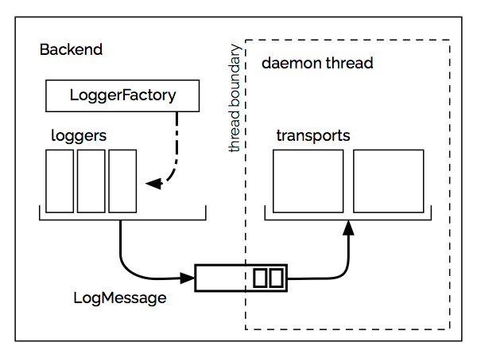

# 

A small (<500 loc), scala-oriented backend for slf4j.

Part of [rbricks](http://rbricks.io), a collection of composable, small-footprint libraries for scala.

[](https://travis-ci.org/rbricks/scalog) [](http://search.maven.org/#search%7Cga%7C1%7Cg%3A%22io.rbricks%22%20a%3A%22scalog-backend_2.12%22)


## Features

1. Extremely simple set-up.

  * In the application entry point, from typesafe config:

    ```scala
    object Main extends App {
      import com.typesafe.config.ConfigFactory
      import io.rbricks.scalog.LoggingBackend
      LoggingBackend.consoleFromConfig(
        ConfigFactory.load().getConfig("logging"))
      // ...
    }
    ```

    Then add the logging config to your `application.conf`:

    ```
    logging {
      some.example.namespace {
        'level = info
        ClassName1 = error
        inner.namespace {
          'level = info
          "ClassName2" = debug
        }
      }
    }
    ```

  * or, in the application entry point, programmatically:

    ```scala
          object Main extends App {
            import io.rbricks.scalog._
            LoggingBackend.console(
              "io.finch" -> Level.Info,
              "com.example.thisapp" -> Level.Debug)
            // ...
          }
    ```

  You can set `-Dscalog.forceColored=yes` as a _java option_ (`javaOptions += "-Dscalog.forceColored=yes"` in `build.sbt`) to enable colorized output even when stdout/stderr don't appear to be ttys.

  Other ways to instantiate the backend can be found in the [scaladoc for `LoggingBackend`](http://rbricks.io/scalog/latest/api/io/rbricks/scalog/LoggingBackend$.html)

2. Easily extensible. See [architecture](#architecture) for details.
3. Support for slf4j's __[MDC (Mapped Diagnostic Context)](http://logback.qos.ch/manual/mdc.html)__ to keep track of context (i.e. http request being handled) between calls.
4. Support for __MDC context propagation__ through future combinators, to keep track of a request handled asynchronously. See [this](contextpropagation/README.md) for details and installation instructions.

__A note on performance.__ The basic precautions to limit useless overhead in the critical path are in place, but performance is not currently a main focus. The library is geared towards ease of use for projects in which raw processing perf is not a big concern either because they act as a hub to networked resources or because they haven't reached a stage in which single-server performance is critical.

Because the library is a slf4j backend, it can be easily swapped out for a more mainstream logging system tuned for performance, such as [logback](http://logback.qos.ch).

## Installation

Artifacts for Scala 2.11 and 2.12 are available on Maven Central.

Add the dependency to your `build.sbt`

```scala
libraryDependencies += "io.rbricks" %% "scalog-backend" % "0.2.0"
```

Additionally, for MDC support, add:

```
libraryDependencies += "io.rbricks" %% "scalog-mdc" % "0.2.0"
```

And refer to [context propagation](#context-propagation) for how to set up MDC propagation through async `Future` combinators.

## Architecture



The `Backend` registers itself as a slf4j `LoggerFactory` and instantiaties `Logger`s on request (calls to `LoggerFactory.getLogger` in client code). Loggers write messages to a thread-safe queue in a non-blocking manner: one tuple `(transport, loggerName, logMessage)` is written for each message and each transport for which the logging level of the message is enabled. The queue is consumed by a separate daemon thread that repeatedly dequeues and forwards the `LogMessage` to the respective transports.

### Transports, formats

A transport extends the `Transport` trait with a single method `write`. It's tasked with receiving a single message and writing/sending it to a destination (e.g. the console or a logging server).

```scala
trait Transport {
  def write(
      name: String,
      logMessage: LogMessage): Unit
}
```

For a certain `Tranpsort`, `write` is invoked once per message in the daemon thread.

A `Transport` can be implemented by extending the trait directly or (more conveniently) by extending any of its descendants. Concrete transports provided are parametrized over `Format[T]` which represents the log message formatting. A `Format[Out]`is a function `(/* loggerName: */ String, LogMessage) => Out`that formats/serializes a certain log message to the specified type `Out` (e.g. to `String` for console output).

Included __formats__ can be found in package [`format`](http://rbricks.io/scalog/latest/api/io/rbricks/scalog/format/index.html).

Included __transports__ can be found in package [`transport`](http://rbricks.io/scalog/latest/api/io/rbricks/scalog/transport/index.html).


[MIT License](LICENSE.txt)
